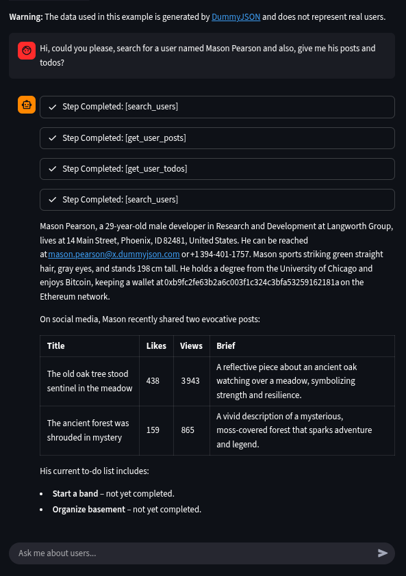

# DummyJSON AI Chatbox
AI Agent Chatbox that give information about users through DummyJSON API
<br>
<br>


### Project Setup

Prerequisites
- Python 3.13 or newer
- pip, virtualenv support
- Ollama installed and available
- Streamlit

Setup steps
1. Create and activate a virtual environment
```bash
python3.13 -m venv .venv
# macOS / Linux
source .venv/bin/activate
# Windows (cmd)
.venv\Scripts\activate
# Windows (PowerShell)
.\.venv\Scripts\Activate.ps1
```

2. Upgrade pip and install dependencies
```bash
python -m pip install --upgrade pip
pip install -r requirements.txt
```

3. Add secrets for Streamlit
Create a file at `.streamlit/secrets.toml` with your Ollama and other secrets.:
```toml
OLLAMA_API = "<local-endpoint>"             # For local
OLLAMA_HOST = "https://ollama.com"          # For cloud
OLLAMA_API_KEY = "<ollama-api-key>"         # For cloud
OLLAMA_MODEL = "<your-model>"
API_URL = "https://dummyjson.com/users"
```

4. Ensure Ollama is running and the model is available (see Ollama docs for install/pull/serve).

5. Run the app
```bash
streamlit run app.py
```
